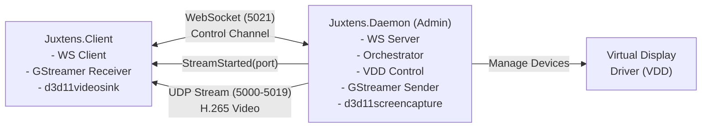

# Juxtens

Virtual display streaming system for Windows. Create virtual monitors, capture their output, and stream over LAN with hardware-accelerated H.265 encoding.

<p align="center">
  
</p>

## Main Applications

### Juxtens.Daemon
**Server component** - Manages virtual displays and streams content to clients.

- Requires **Administrator privileges** (virtual display driver management)
- Creates/destroys virtual displays on demand
- Captures display output via GStreamer (NVENC H.265)
- Streams over UDP to connected clients
- WebSocket control interface (0.0.0.0:5021)
- WPF UI with connection status and logs

**Usage**: Run as Administrator on the machine where you want to create virtual displays.

### Juxtens.Client
**Client component** - Connects to daemon and displays streamed content.

- No elevation required
- Connect to daemon by IP address
- Request streams, display in separate windows
- GStreamer receiver (hardware-accelerated decode)
- WPF UI with connection controls

**Usage**: Run on any machine on the same network, connect to daemon IP.

## Debugging

### Juxtens.Server
Legacy WinForms testing UI with direct access to all components. Superseded by Daemon/Client split in production but useful for development/debugging.

- Requires **Administrator privileges**
- Direct device management controls
- Manual stream testing

## Supporting Libraries

| Library | Purpose |
|---------|---------|
| **Juxtens.Logger** | File-based logging abstraction |
| **Juxtens.DeviceManager** | Windows device management via cfgmgr32/SetupAPI |
| **Juxtens.VDDControl** | Virtual Display Driver configuration |
| **Juxtens.GStreamer** | GStreamer process wrapper (sender/receiver pipelines) |

## Technology Stack

- **.NET 9.0** (C# with nullable reference types)
- **WPF** (Daemon, Client) / **WinForms** (Server)
- **GStreamer 1.28.0** (NVENC H.265 encoding/decoding)
- **WebSockets** (Fleck library for control channel)
- **Virtual Display Driver** (third-party VDD, XML configuration)
- **Windows APIs** (cfgmgr32.dll, SetupAPI for device management)

## Architecture



## Flow

1. **Client** connects to **Daemon** via WebSocket
2. User requests stream (Add Stream button)
3. **Daemon** creates virtual display, starts GStreamer sender
4. **Daemon** responds with port and monitor info
5. **Client** starts GStreamer receiver on specified port
6. Stream displayed in separate window on **Client**
7. User closes window → **Client** notifies **Daemon** → cleanup

## Requirements

- **Windows 10/11** (x64)
- **Administrator privileges** (Daemon/Server only)
- **GStreamer 1.28.0** with NVENC/NVDEC support
- **Virtual Display Driver** installed and configured
- **NVIDIA GPU** (for hardware-accelerated encoding/decoding)

## Build

```powershell
dotnet build
```

Build output:
- `Juxtens.Daemon/bin/Debug/net9.0-windows/Juxtens.Daemon.exe` (Run as Admin)
- `Juxtens.Client/bin/Debug/net9.0-windows/Juxtens.Client.exe`
- `Juxtens.Server/bin/Debug/net9.0-windows/Juxtens.Server.exe` (Run as Admin)

## License

© 2026 DeeJayy. License: MIT.
